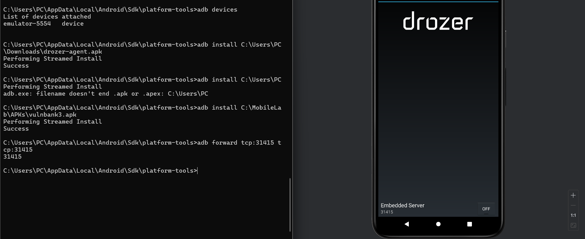
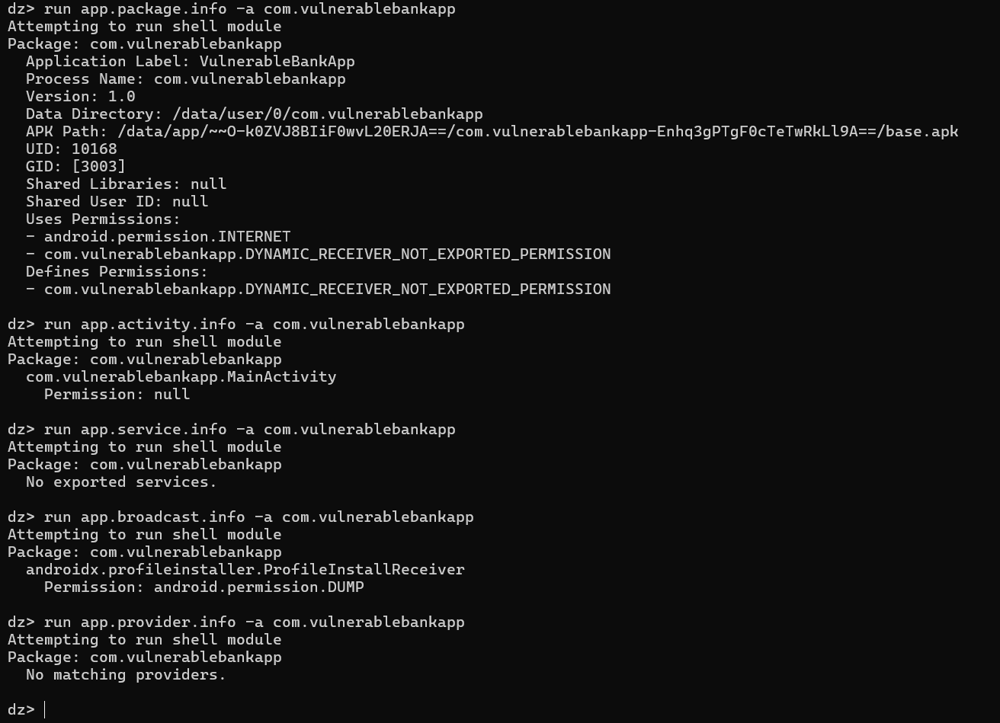
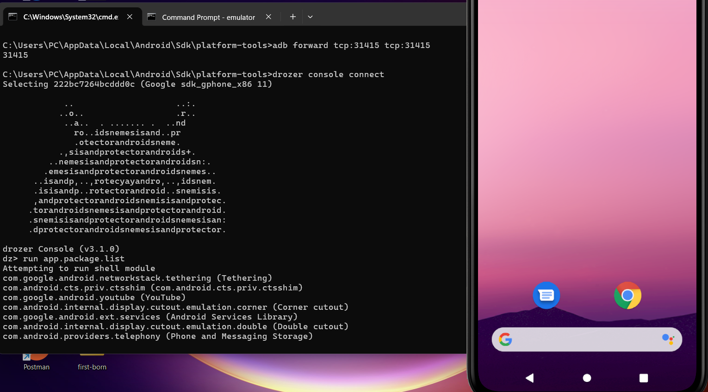
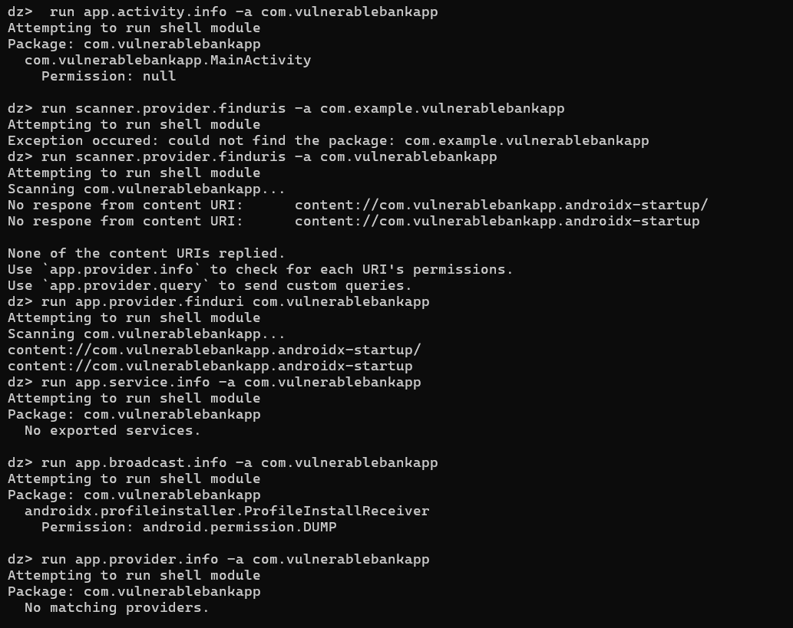
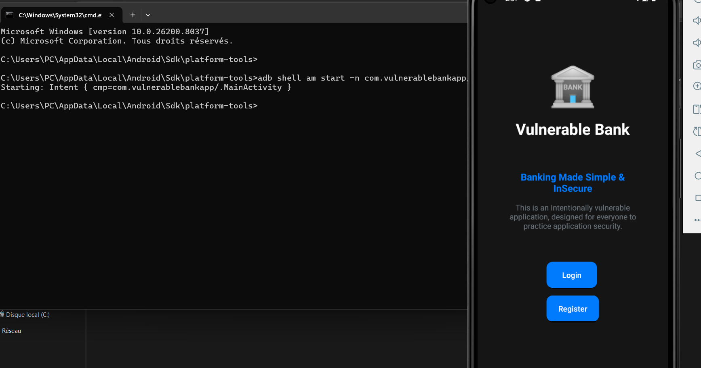

# Rapport d'audit de sécurité - Application Android
 
## Informations générales
 
- **Application** : VulnBank
- **Package** : com.vulnerablebankapp
- **Version** : 1.0
- **Date d'audit** : 31/03/2026
- **Auditeur** : Yassir Nacir
 
---
 
## Résumé exécutif
 
L'audit de sécurité de l'application *VulnerableBankApp* a permis d'identifier plusieurs vulnérabilités liées à la configuration et à la gestion des données sensibles.
 
La vulnérabilité la plus critique concerne la présence d'informations sensibles directement dans le fichier AndroidManifest, ce qui peut entraîner une compromission totale de l'application.
 
D'autres faiblesses incluent l'autorisation de communications non sécurisées (cleartext), l'activation des sauvegardes ADB, ainsi qu'une exposition partielle des composants Android.
 
Globalement, bien que la surface d'attaque soit limitée au niveau des composants exportés, les mauvaises pratiques de sécurité représentent un risque élevé.
 
---
 
## Méthodologie
 
Les étapes suivantes ont été réalisées :
 
- Analyse statique du fichier AndroidManifest.xml
- Identification des composants exportés avec Drozer
- Vérification des permissions et des protections
- Analyse des configurations de sécurité
- Évaluation des risques potentiels
 
---
 
## Découvertes principales
 
### 1. Données sensibles exposées dans le manifest
 
- Présence d'informations sensibles (identifiants, endpoint debug)
- Risque : compromission totale de l'application
- Sévérité : **Critique**
 
---
 
### 2. Activity exportée sans protection
 
- MainActivity accessible sans restriction
- Risque : accès non autorisé / contournement logique
- Sévérité : **Moyenne**
 
---
 
### 3. Cleartext traffic autorisé
 
- Communications non chiffrées possibles
- Risque : interception des données (attaque MITM)
- Sévérité : **Moyenne**
 
---
 
### 4. allowBackup activé
 
- Données récupérables via ADB
- Risque : fuite d'informations utilisateur
- Sévérité : **Moyenne**
 
---
 
### 5. Broadcast Receiver exporté (protégé)
 
- Protégé par permission système
- Risque limité
- Sévérité : **Faible**
 
---
 
## Recommandations prioritaires
 
### 1. Supprimer les données sensibles du manifest
 
- Ne jamais stocker de credentials en clair
- Utiliser un stockage sécurisé (Keystore, backend sécurisé)
 
---
 
### 2. Désactiver le trafic non chiffré
 
```xml
android:usesCleartextTraffic="false"
```
 
---
 
### 3. Désactiver allowBackup
 
```xml
android:allowBackup="false"
```
 
---
 
### 4. Restreindre les composants exportés
 
- Mettre `exported="false"` si non nécessaire
- Ajouter des contrôles d'authentification
 
---
 
### 5. Valider les intents reçus
 
- Vérifier les données entrantes
- Implémenter des contrôles côté application
 
---
 
## Annexes
 
### Annexe A : Tableau de triage complet
 
Voir : `/preuves/` — tableau de priorisation des vulnérabilités
 
### Annexe B : Captures d'écran des preuves
 





 
### Annexe C : Mapping OWASP MASVS
 
Voir : `/preuves/` — tableau de Mapping OWASP MASVS
 
---
